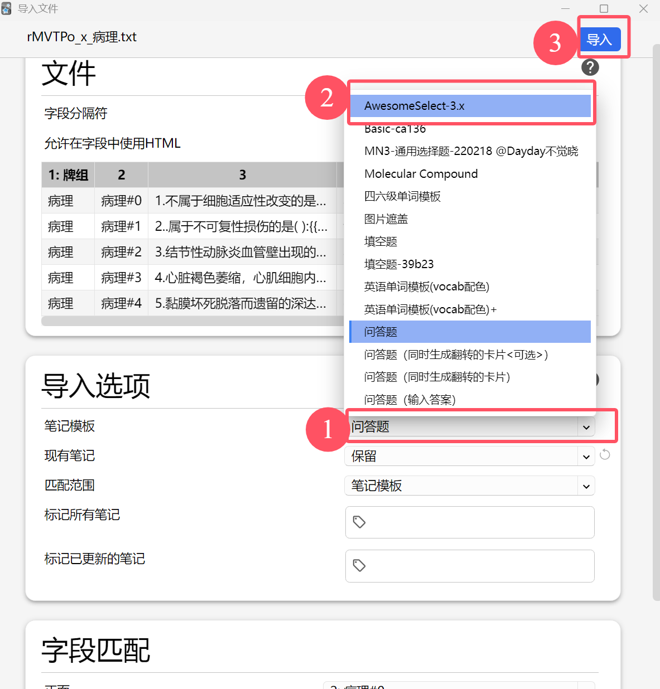

# 佛脚刷题转Anki牌组脚本
# 使用教程
## 1. 获取题库ID
### 在佛脚刷题小程序中，进入想要下载的题库页面，点击```分享题库```，```复制ID```

## 2.填写参数并下载题库
### 打开```parser_gui.exe``` 将复制的题库ID填入其中，填写想要显示的题库名称和保存位置，点击```开始处理```

## 3.导入anki软件
### 首先，导入[Awesomeselect](https://github.com/git9527/anki-awesome-select)示例牌组
### 然后，在anki页面左上角```选择文件-导入```，并选择下载的题库文件(.txt文件)(也可将下载完的题库文件直接拖入anki主页面），弹出以下页面：

### 点击```笔记模板```选项右侧的下拉框，并将其选为```AwesomeSelect-3.x```
### 最后，然后点击```导入```，即可使用。
## 4.记得以你自己喜欢的方式修改牌组中卡片的学习间隔
